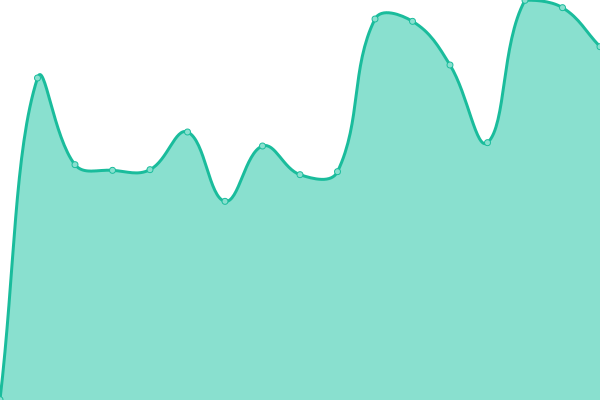
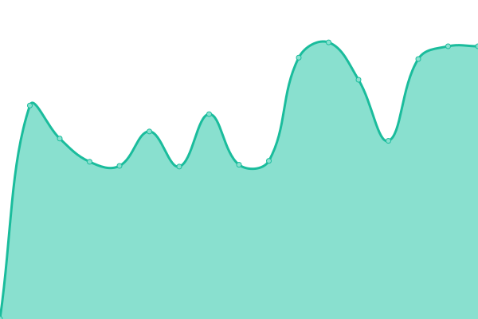
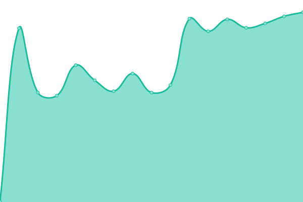
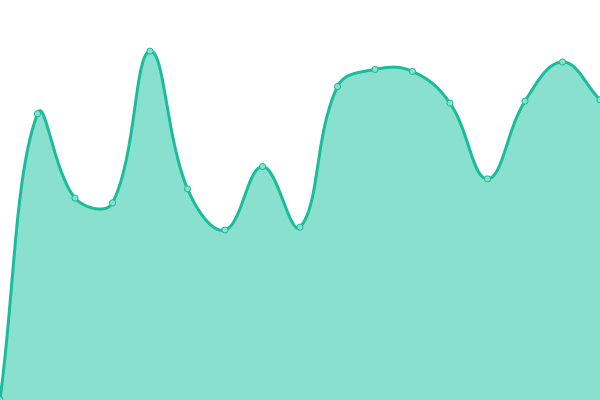
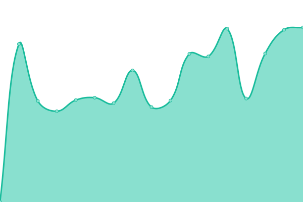
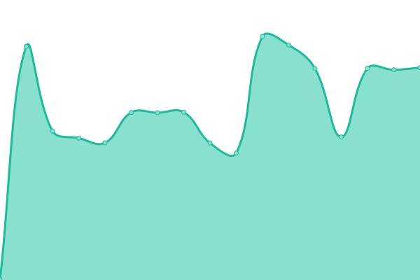

# [📈 Live Status](https://eddiebt.github.io/BTCWebMonitor): <!--live status--> **🟥 Complete outage**

This repository contains the open-source uptime monitor and status page for [Eddie Beaumont-Thomas](http://www.beaumont-thomas.com), powered by [Upptime](https://github.com/upptime/upptime).

With [Upptime](https://upptime.js.org), you can get your own unlimited and free uptime monitor and status page, powered entirely by a GitHub repository. We use [Issues](https://github.com/eddiebt/BTCWebMonitor/issues) as incident reports, [Actions](https://github.com/eddiebt/BTCWebMonitor/actions) as uptime monitors, and [Pages](https://eddiebt.github.io/BTCWebMonitor) for the status page.

<!--start: status pages-->
<!-- This summary is generated by Upptime (https://github.com/upptime/upptime) -->
<!-- Do not edit this manually, your changes will be overwritten -->
<!-- prettier-ignore -->
| URL | Status | History | Response Time | Uptime |
| --- | ------ | ------- | ------------- | ------ |
|  [AYS Business Moves](https://aysbusinessmoves.co.uk/) | 🟥 Down | [ays-business-moves.yml](https://github.com/eddiebt/BTCWebMonitor/commits/HEAD/history/ays-business-moves.yml) | 

 886ms
     
 | 

<a href="https://eddiebt.github.io/BTCWebMonitor/history/ays-business-moves">99.97%</a>
    

|  [KJM Ceremonies](https://kjmceremonies.co.uk/) | 🟥 Down | [kjm-ceremonies.yml](https://github.com/eddiebt/BTCWebMonitor/commits/HEAD/history/kjm-ceremonies.yml) | 

 959ms
     
 | 

<a href="https://eddiebt.github.io/BTCWebMonitor/history/kjm-ceremonies">99.98%</a>
    

|  [Romsey Area Information Network](https://romseyareainfo.net/) | 🟥 Down | [romsey-area-information-network.yml](https://github.com/eddiebt/BTCWebMonitor/commits/HEAD/history/romsey-area-information-network.yml) | 

 880ms
     
 | 

<a href="https://eddiebt.github.io/BTCWebMonitor/history/romsey-area-information-network">99.98%</a>
    

|  [The London Aikdo Club](https://thelondonaikidoclub.co.uk/) | 🟥 Down | [the-london-aikdo-club.yml](https://github.com/eddiebt/BTCWebMonitor/commits/HEAD/history/the-london-aikdo-club.yml) | 

 963ms
     
 | 

<a href="https://eddiebt.github.io/BTCWebMonitor/history/the-london-aikdo-club">99.99%</a>
    

|  [The Yellow Cottage](https://theyellowcottage.co.uk/) | 🟥 Down | [the-yellow-cottage.yml](https://github.com/eddiebt/BTCWebMonitor/commits/HEAD/history/the-yellow-cottage.yml) | 

 938ms
     
 | 

<a href="https://eddiebt.github.io/BTCWebMonitor/history/the-yellow-cottage">99.99%</a>
    

|  [Sandspur](https://sandspur.co.uk/) | 🟥 Down | [sandspur.yml](https://github.com/eddiebt/BTCWebMonitor/commits/HEAD/history/sandspur.yml) | 

 858ms
     
 | 

<a href="https://eddiebt.github.io/BTCWebMonitor/history/sandspur">100.00%</a>
    

<!--end: status pages-->

[**Visit our status website →**](https://eddiebt.github.io/BTCWebMonitor)

## 📄 License

- Powered by: [Upptime](https://github.com/upptime/upptime)
- Code: [MIT](./LICENSE) © [Anand Chowdhary](https://anandchowdhary.com), supported by [Pabio](https://pabio.com)
- Data in the `./history` directory: [Open Database License](https://opendatacommons.org/licenses/odbl/1-0/)
